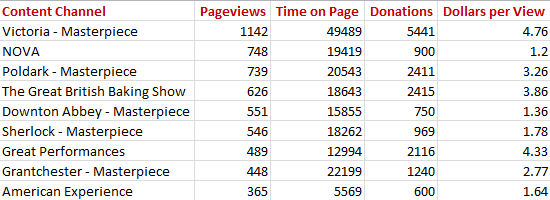
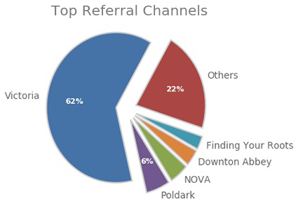
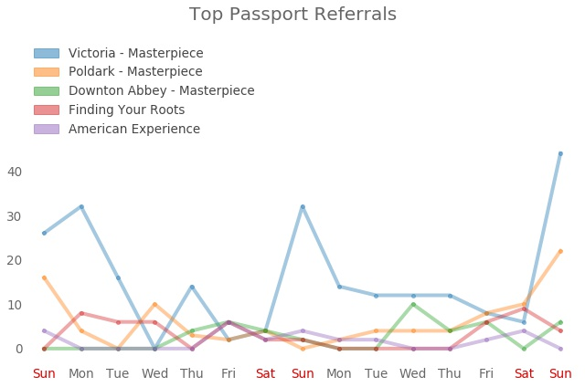

# KLRN Passport Referrals Database 

This is an analytics database and visualization tool to track PBS video referrals to KLRN's Passport donation page. KLRN Passport is a member benefit offering on-demand access to PBS shows.

Referrals are tracked through a "referrer=" query that PBS adds to KLRN's donation-page link. The queries, reported in Google Analytics, show what web addresses the clicks came from.

This application pulls daily stats for URLS with the "referrer=" tag, along with related eCommerce stats, from Google Analytics. Web scrapers follow each URL to grab video IDs, titles and descriptions, which are then stored in a SQLite database.

Another part of the application charts and visualizes top shows and episodes that send the most people to KLRN's Passport donation page, and which ones bring in the most dollars.

<br>

 

<br>

### Getting started

This is a Python 2.7 application using code adapted from Google Analytics Reporting API v4. [Google's quickstart guide](https://developers.google.com/analytics/devguides/reporting/core/v4/quickstart/installed-py). steps through enabling the API, creating credentials, installing the client library and setting up the code.

The quickstart process produces a client_secrets.json file and a Google Analytics View ID. For this application, the client_secrets.json file was added to the auth folder. Also, a settings.py file was created and added to the auth folder, and a string variable added to store the View ID: `view_id = YOUR_VIEW_ID`. 

### Getting data  

These files, in this order, retrieve daily page stats from Google Analytics, scrapes information from referrer pages and then scrapes titles and descriptions from videos. 

- db_pages.py
- db_referrers.py
- db_videos.py

In the db_conn() function in the db_pages.py file, there is a line to set the default starting date for Google Analytics. It only needs to be set once - a SQL query then checks the most recent updates and starts from there.

```python
#default starting date, which is a date in utc seconds
#this is set to day before KLRN Passport started
last_date = datetime_to_seconds(datetime.date(2016, 4, 3))  
```

Scraping results from db_referrers.py and db_videos.py get printed out. Code in scrapers.py and scrapers_selenium.py often needs refactoring or additions to deal with changes on web pages. 

To help check scrapers, the scrape_page() functions in db_referrers.py and db_videos.py are pulled into test.py, and each is slightly renamed.

Also, scrapers_selenium.py uses chromedriver.exe, located in the bin folder. Code often breaks when a chromedriver.exe version is too old.

<br>



<br>

### Charting and graphing  

To run visualizations, the Python library Matplotlib must be installed.

These files create tables and graphics, and adds them to the output folder. Each file has a settings block at the top for date ranges, query types, etc.   

- queries_counts.py aggregates Pageviews and Donations by days, weeks or months  
- queries_views_channels.py aggregates stats by top shows, or plots daily trends  
- queries_views_episodes.py aggregates by top episodes (shows have multiple episodes)

The queries_views_episodes.py can be run alone or through queries_views_channels.py by setting `run_episodes = True`

<br>



<br>

### Searching the database

Upload the database into a SQLite-compatible editor or viewer. A nice, free option is [DB Browser for SQLite](http://sqlitebrowser.org/). 

With DB Browser open, click the Open Database button at the top. In the file navigator that opens, go to app/database in the application and load db.sqlite.

Click the Browse Data tab to view, sort and filter the data tables. 

Click the Execute SQL tab to open an interface to run SQL queries. In the app folder, the file queries.txt provides basic queries.

### Other files

These files store other background functions:

- db_backup.py
- graphs.py

### Future iterations

- Create one run file to handle all data-gathering files
- Add command line interface
- Move online, and add user login 
- Add dashboard  
- Set chron job to update daily, and send status emails
- Add ability to schedule email dashboard reports

### References

- https://www.python.org/
- https://developers.google.com/analytics/devguides/reporting/core/v4/quickstart/installed-py
- https://ga-dev-tools.appspot.com/account-explorer/
- http://matplotlib.org/
- http://sqlitebrowser.org/